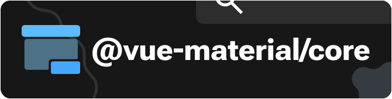
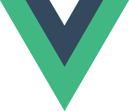
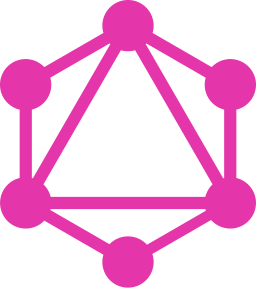
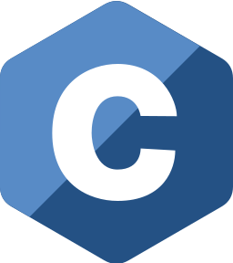
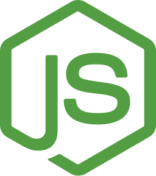

# 👋 Hello! I'm Kyle

🎓 A student programmer based in the **Philippines**.\
⚡️ Currently working as a **full-stack web developer**.

<picture>
  <source media="(prefers-color-scheme: dark)"
  srcset="https://github-readme-streak-stats.herokuapp.com?user=obillekyle&theme=dark&hide_border=true&stroke=0D1017&background=0D1017" />
  <source media="(prefers-color-scheme: light)"
  srcset="https://github-readme-streak-stats.herokuapp.com?user=obillekyle&theme=light&hide_border=true&stroke=FFFFFF&background=FFFFFF" />
  
</picture>

### Active Projects

Here are some of the projects that I currently spent my time working on.

### Currently Used Technologies

### Currently Learning

### Previously Used Technologies

### Other

> [!NOTE]
> I might be less active these days as I try keep up with my acads.
